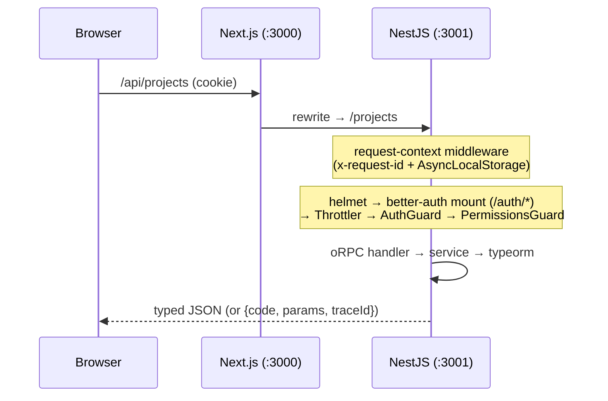

# Architecture

## Monorepo layout

```
apps/
  web/                  Next.js 16 — UI, same-origin /api proxy, no business logic
  api/                  NestJS 11 — the single authority for data, auth, authorization
packages/
  contracts/            THE source of truth: zod schemas, oRPC contract,
                        error catalog, permission definitions
  db/                   TypeORM entities, hand-written migrations, seeds, DataSource factory
  auth/                 better-auth factory (org/member lifecycle hooks)
  fga/                  OpenFGA model (model.fga), client, bootstrap + sync
  emails/               react-email templates + render helper
  i18n/                 locale config + message catalogs (next-intl typed keys)
  ui/                   shadcn/ui design system (source-exported, Tailwind v4 tokens)
  typescript-config/    tsconfig presets (base / library / nestjs / nextjs / react-library)
turbo/generators/       `pnpm gen feature` vertical-slice scaffolding
```

Dependency direction is strictly one-way:

```
web ──┐
      ├──▶ contracts ◀── db ◀── auth
api ──┘        ▲                 ▲
               └────── api ──────┘
```

`contracts` depends on nothing internal. Nothing imports from an app.

## Contract-first type safety

One feature = one contract in `packages/contracts/src/<feature>.ts`: zod
schemas + oRPC routes (`method`, `path`, `input`, `output`, shared error
surface from `base.ts`).

- **api** implements it with `@orpc/nest`: each procedure is a real NestJS
  controller method (`@Implement(contract.projects.list)`), so DI, guards and
  interceptors keep working. Handlers receive **parsed** input (schema output
  types); type service parameters accordingly — never with
  `InferContractRouterInputs`, which is the client-side input view.
- **web** derives a typed client (`src/lib/api.ts`) and TanStack Query helpers
  (`orpc.projects.list.queryOptions(...)`) from the same contract. No codegen
  step: change a field and both sides fail to compile.
- OpenAPI 3.1 falls out for free at `GET /api/openapi.json`
  (`apps/api/src/docs/docs.module.ts`) for external or mobile consumers.

## Request lifecycle



Everything is **same-origin**: the browser only ever talks to the web origin.
In dev, `next.config.ts` rewrites `/api/:path*` to the api; in production the
reverse proxy routes the `/api` prefix instead (see `docs/deployment.md`).
CORS and cookie domains are therefore non-issues by construction.

The express stack order in `apps/api/src/app.setup.ts` is load-bearing:

1. `requestContextMiddleware` — assigns `x-request-id`, opens the
   AsyncLocalStorage scope that logger, guards, services and the exception
   filter all read from (`common/request-context.ts`).
2. `helmet`, CORS.
3. **better-auth handler** — mounted *before* `app.init()` because Nest
   registers its 404 catch-all during init. The mount re-prefixes the URL
   (`/auth/x` → `/api/auth/x`) because better-auth matches requests against
   the path of its public `baseURL` and the proxy strips `/api`.
4. Nest router: global guards run rate-limit → authenticate → authorize.

## Authentication

Better-auth lives on the api (`packages/auth/src/auth.ts`, wired in
`apps/api/src/auth/auth.module.ts`):

- email + password, email verification and password reset (mails go through
  the BullMQ queue), `admin` plugin for roles/bans/impersonation.
- built-in **rate limiting** on the auth endpoints (`AUTH_RATE_LIMIT_ENABLED`,
  Redis-backed via secondary storage, tighter rules for sign-in/sign-up/reset) —
  the express-mounted auth handler bypasses Nest's `ThrottlerGuard`, so this is
  the only limiter covering it.
- Sessions live in **Redis secondary storage** plus a 5-minute signed
  **cookie cache**, so most requests never touch a store; the Postgres
  `session` table is a read model that stays empty in this configuration.
  Consequence: role changes take effect on the next sign-in or after the
  cookie cache expires — the integration test documents this.
- `baseUrl` must be the full public auth base (`${WEB_URL}/api/auth`): a path
  inside better-auth's `baseURL` *is* its router mount path and the base for
  generated links.

The web app uses `authClient` (`apps/web/src/lib/auth-client.ts`) for
sign-in/up/out and `useSession`. `src/middleware.ts` does fast cookie-presence
redirects only — real enforcement is always the api's `AuthGuard`.

## Authorization (OpenFGA + Postgres RLS)

- The authorization model lives in `packages/fga/model.fga` (OpenFGA DSL);
  relationship tuples mirror the database (Postgres is the source of truth,
  `pnpm fga:sync` reconciles). The api checks capabilities over the network
  via `FgaService` (`apps/api/src/fga/`); the web consumes a capability
  snapshot from `GET /me/permissions` (`apps/web/src/lib/permissions.tsx`,
  `<Can>` / `useCan()`). UI gating is cosmetic; the api is the authority.
- Enforcement is three-layered: `@RequirePermission({ relation, scope })`
  for coarse route checks (PermissionsGuard), `fga.check(fga.me(),
  "can_update", fga.ref.project(id))` in services for row-level checks, and
  Postgres row-level security underneath (`DbService.tenant(...)`) so a
  forgotten WHERE clause cannot cross a tenant boundary.
- The relation vocabulary depends on the model chosen at scaffold time
  (RBAC roles + grants, or ReBAC per-project relations) — see
  `docs/authorization.md` for the full picture of this project's setup.

## Error pipeline

Single wire shape everywhere: `{ code, params, traceId }`.

1. `packages/contracts/src/errors.ts` — the catalog. Each code carries a zod
   schema for its i18n params, enforced at runtime by `errorData()`.
2. Services throw `appError(code, params)` (`apps/api/src/common/app-error.ts`),
   an `ORPCError` serialized by oRPC inside handlers.
3. Everything thrown *outside* handlers (guards, throttler, unknown routes,
   crashes) goes through `AllExceptionsFilter`, which emits the exact same
   JSON shape and logs 5xx with the `traceId`.
4. The web normalizes anything with `extractApiError()` and translates via
   `useApiErrorMessage()` — codes map to `errors.<CODE>` in
   `packages/i18n/messages/*.json`, params are the interpolation values.
5. `traceId` equals the api log line's id and the `x-request-id` response
   header — one identifier from toast to log.

## Data layer

TypeORM (Postgres), one entity per file in `packages/db/src/entities/` with
explicit column types — the default naming strategy keeps every column
camelCase (property name == column name; see `docs/database.md`). Migrations
are hand-written classes (`packages/db/src/migrations/`, an explicit list, no
glob) applied by a **programmatic migrator** (`src/migrate.ts`) that needs
only runtime deps — the same compiled file runs locally and as the compose
`migrate` one-shot service. Seeding is split: baseline (roles/grants — safe
anywhere) in `@repo/db`, dev fixtures (users, demo projects — refuses
`NODE_ENV=production`) in `@repo/auth`.

## Why the internal packages compile to CommonJS

The api is CJS (NestJS's paved road); Next bundles anything. If the shared
packages were ESM, TypeScript would load ESM-typed deps (typeorm, orpc)
through two resolution modes and their nominal private fields collide. CJS
everywhere internal = one type identity per dependency. Practical
consequences:

- script entrypoints use `main().catch(...)`, never top-level `await`;
- DI tokens live in `*.constants.ts` files, never in the Nest module file
  that provides them — a service importing a token from its own module is a
  circular import and the token evaluates `undefined` inside `@Inject()`;
- in `apps/api`, classes used for constructor injection must stay **value
  imports** (`useImportType` is disabled there — `import type` erases the
  runtime metadata Nest resolves DI from).
